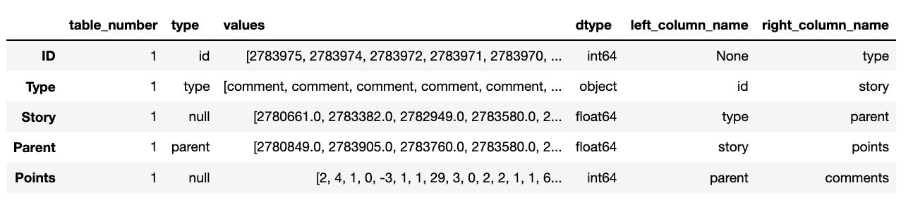
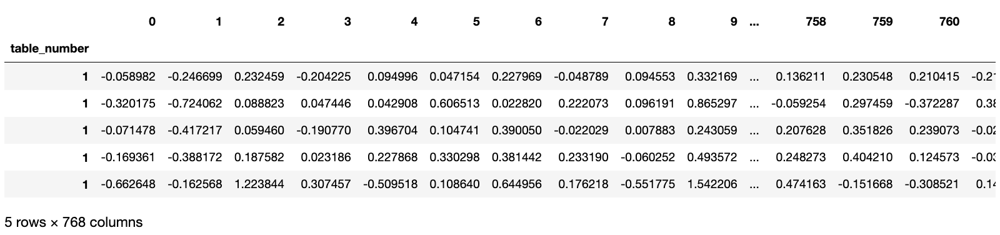
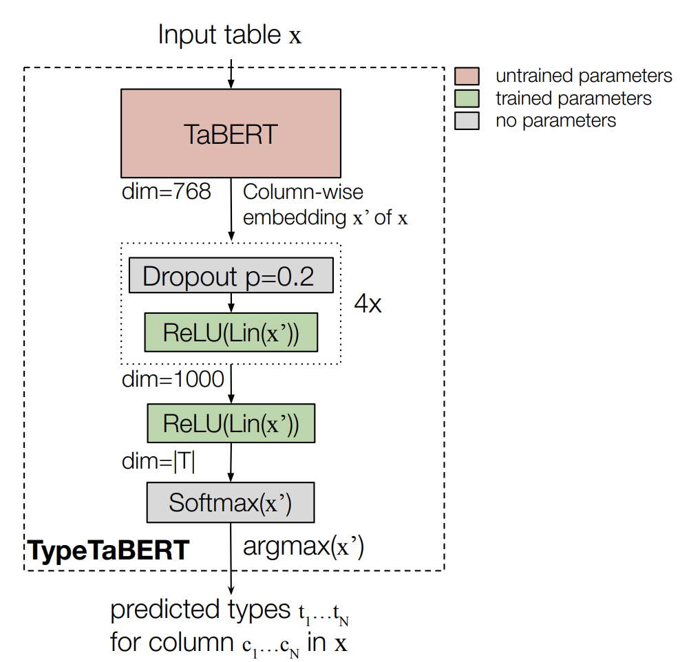
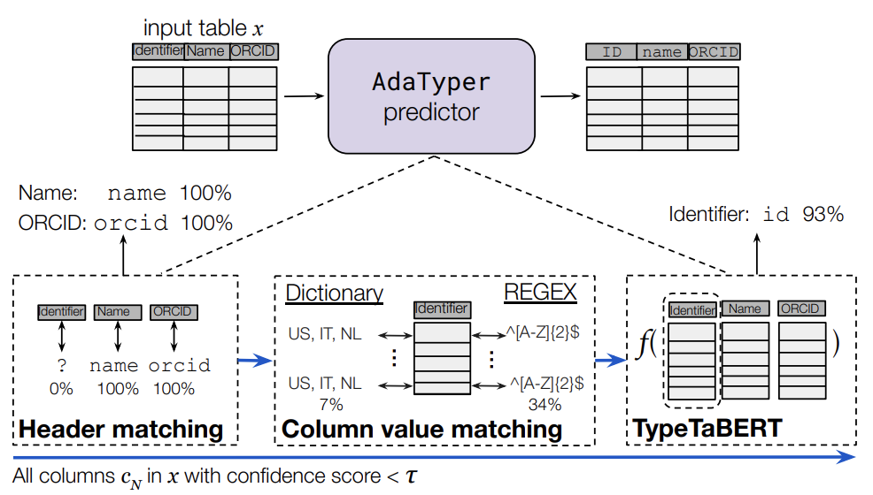
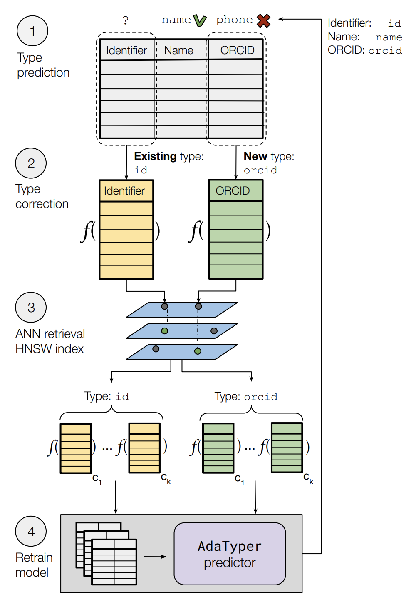

# AdaTyper

**All commands below should be run from the root of the project.**

----

## Project goal

This project provides a semantic type detection system to infer the semantic types from table columns.

----

## High level implementation

### Input data (and preprocessing)

AdaTyper is trained on tables from GitTables (https://gittables.github.io). This dataset provides semantic column type annotations and is ought to resemble tables typically encountered in databases. The input data for training the AdaTyper predictor (yielding type predictions for each column in a table) stems from 1) the raw values of columns in a table, and 2) embeddings of table columns obtained using a pretrained table model (TaBERT).

The `adatyper/preprocessing.py` module implements these preprocessing steps for tables in GitTables (download instructions can be found below). Each of the resulting datasets (raw and embedded, which are stored separately) has the training data columns on the rows and the feature representations (raw values or embedding, along with the labels i.e. corresponding semantic type) in the columns.

The dataset with raw values looks as follows:


The dataset with the embedding representation of columns looks as follows:



### Detection pipeline

The detection pipeline is constructed as a sequential pipeline of multiple estimators, as shown in Figure 1 and summarized in the below table. Each of the estimator classes extends the base estimator class from scikit-learn and implements the `fit`, `predict`, and `predict_proba` methods. Each estimator class is prepended with the table element level that it operates on (i.e. header, values, table).

| Estimator  | Training data | Table element |
|------------|---------------|---------------------|
| Header matching (syntactic and semantic) | None | column header|
| Regular expression matching | None | column values |
| Labeling function matching | None | column values |
| Dictionary lookup | GitTables | column values |
| Machine learning model | GitTables | entire table |
 
The code for the estimators can be found in `adatyper/base_estimator.py`. Below we provide brief summaries of each estimator.

#### Header matching
This estimator compares a column name, syntactically and semantically, with each type in the type catalog of AdaTyper (see `adatyper/types.json`). The syntactic estimator performs basic cleaning transformations before comparing the two strings, and outputs 100 (a match) or 0 (no match). The semantic estimator embeds the column name and each type with the Universal Sentence Encoder, and outputs the cosine similarity between the two embeddings.

#### Value regular expression matching
This estimator is matches column values to regular expressions, as preset in a 'dictionary' of regular expressions for each type (see `adatyper/types_regex.json`). At inference, it returns the fraction of column values that matches with the regular expressions of a type.

#### Value dictionary matching
This estimator is reflects a dictionary that is populated with the most frequent values occurring in columns of each type as found in tables in GitTables. At inference, it returns the fraction of column values that intersects with the dictionary values of each type.

#### TypeTaBERT (ML Model)
Two ML models are implemented for TypeTaBERT. Both models take as input column-wise table embeddings (i.e. full tables are embedded with TaBERT, and split into column embeddings) and learn from this. First, we implemented the `MachineLearningExperimentsEstimator` to enable efficient development iterations. This estimator basically trains a Random Forest classifier on the column embeddings. Second, we have the `MachineLearningEstimator` which is the TypeTaBERT model that fine-tunes TaBERT for column type prediction. However, we do not train the parameters of TaBERT for type prediction, given that we need generalizable representations (and not tuned towards the types in scope, i.e. see `types.json`). The below figure shows the simple NN architecture of this TypeTaBERT model.




### Sequential pipeline

The estimators are executed in order of complexity. For example, extracting embeddings for a table can be an expensive operation while matching column names with types (and/or their embeddings) is less intensive. Moreover, not all estimators may need to be executed as one basic estimator might already yield a confident prediction.

The pipeline therefore iterates over the table columns, executing one estimator at a time. If the estimator yields a sufficiently confident prediction (based on preset confidence thresholds), the other estimators are not executed. If no estimator yields a confident prediction, the column is labeled as `null`. The below figure illustrates the full pipeline.

The code for this pipeline can be found in `adatyper/pipeline.py`.




### Adaptation

For end-users it can be important to adapt the type predictions towards their own data context. This customization is implemented using weak-supervision. That is, based on corrections of the predicted type from the end user, the corresponding column is used as an 'example' for finding similar columns in the training dataset. This example column is first embedded with TaBERT, after which k=50 Approximate Nearest Neighbors are retrieved from the Hierarchical Navigable Small World (HNSW) index as shown in the below figure. In turn, this newly generated training data along with the source training data is used to retrain, hence adapt, the model towards the end-user's data.

The code for this component can be found in `adatyper/adaptation.py`.




----

## Components
The app consists of a few components:
- App (`app/`) of lightweight front-end and backend to collect a new data file (CSV), serve predictions, and get feedback from an end-user.
    - Main routing through `app/main.py`
    - HTML page template `app/templates/index.html`
- Python package (`adatyper/`) consisting of the modules to generate data, train, adapt and deploy the type detection pipeline.
    - `adaptation.py`: module for generating training data for new types from examples of columns in the table of the end-user.
    - `base_estimator.py`: module with 'weak' estimators (header matching, column value lookups (trained dictionary, DBpedia knowledge base, regular expressions, functions) and machine learning model) used in the aggregated pipeline for detecting semantic types.
    - `pipeline.py`: module with the main pipeline from table data to predictions (train and inference).
    - `preprocess.py`: module for generating training data from tables in GitTables.
    - `type_regex.json`: mapping from types to regular expressions and the corresponding sources thereof.
    - `utils.py`: some supportive functions that are used across modules, e.g. for loading data and embedding tables.
    - `value_matching.py` (legacy): mappings from types to functions that were used to check if a column's value could correspond to the given type.
- Python scripts and results for evaluating AdaTyper (`evaluation/`).
    - `predictors_evaluation.py`: module with functions for evaluating the AdaTyper predictor on GitTables and/or CTU. It also provides the option to evaluate the performance of the estimators for different confidence thresholds.
    - `adaptation_evaluation.py`: module with functions for evaluating the HNSW index for TaBERT embeddings of tables in GitTables as well as the downstream adaptation performance of the AdaTyper adapter on tables from the CTU repository.
- Scripts in `scripts`: with some shell code for executing all steps in the process of training and evaluating AdaTyper.
- Ontologies with the types to detect.
    - `adatyper/types.json`: ontology of semantic types tailored to Sigma.
    - `dbpedia_20210528.csv`: ontology used to annotate the GitTables dataset.
    - `FlatSemanticTypes.csv`: ontology of semantic types tailored to Sigma.
- `typetabert/`: directory with code used for training the NN-based TypeTaBERT model. See `typetabert/README.md` for more details.
- `table_bert/`: directory with depdency code from TaBERT. Visit the original TaBERT GitHub repository for more details: https://github.com/facebookresearch/TaBERT.

Motivation and design principles can be found in the paper [here](https://drive.google.com/file/d/1qKjV3SyR1e2JNLYU5PaeNYRHsJI9TFto/view?usp=sharing).

----

## Installation

The code in this repository was developed with Python 3.9.5. Some packages might not work with versions before or after this.

First create an environment using a package manager of your choice and make sure that pip is installed (e.g. with conda `conda create -n "adatyper" python=3.9.5`). Then install the dependencies as follows.
```
    $ pip install -r requirements.txt
    $ torch-scatter==2.1.0
```
`torch-scatter` is installed separately as it seemingly depends on a completed installation of `torch`, which is not the case upon collecting the package when installing through a requirements file.
When updating `requirements.txt` in the future, it may be therefore be needed to remove `torch-scatter` from the `requirements.txt` file.

Make sure that you are using the python executable from inside the created environment (e.g. with `which python`).

Note: the dependencies can be slimmed down and separated for development vs deployment in the future.

----

## Dependency downloads

If one wants to use the already trained estimators instead of retraining from scratch (see instructions below), the dependency models (TaBERT, the AdaTyper estimators, and the HNSW index) can be downloaded as follows:
```
    $ bash scripts/download_dependency_artifacts.sh
```

----

## Deployment

If there is a trained pipeline available, one can use the app to go through the full process for generating type predictions for a given table, and potentially adapting the model towards new types.

### Infer types from file upload

The app can be run as follows:
```
    $ flask run
```

It takes a minute or so for the app to be ready. The app is served on `127.0.0.1:8000`.

A few test CSV files can be found in the `test_data/` directory.


### Adapt type catalog (end-user perspective)

This app facilitates model adaptation as well.

Once initial inferences are generated through the UI, the end-user can relabel a column from the user-interface (input: `column name` and `type`).

1. The extraction of new data requires an HNSW index populated with column embeddings from GitTables (see section 'Dependency Downloads'). This index can be rebuilt using `adatyper/adaptation.py`.
2. `k` columns most similar to the embedding of the example column are retrieved from the HNSW index. These `k` columns are then added to the training data, which is stored with the prefix `training_data_latest.pickle`.
3. Finally, the pipeline is retrained on the initial training data and the newly generated data (`data/adaptation/generated_training_data/`) is saved for future training.

----

## (Re)training

The app needs a trained pipeline. Although there is a pretrained pipeline for 25 types present for out-of-the-box usage (see `models/`), future iterations might need new models. Execute the steps below to obtain one (the order of steps is important).

### Extend the type ontology

The types are currently scoped to the types in `adatyper/types.json`. This can be changed, if desired, by simply adding types to this ontology. The types should correspond to types in the DBpedia ontology used for annotating GitTables (see `ontologies/dbpedia_20210528.csv`).

### Generate training data

AdaTyper needs data to be trained on and to make inferences for columns in unseen tables.
Training the type detection pipeline is supervised, meaning that each table column should be associated with a class label (the semantic type of the column).

1. Download one or multiple topic subsets with tables from GitTables (https://gittables.github.io):

```
    $ bash scripts/download_gittables_tables.sh.
```

2. Ensure that the tables exist in the `data/` directory, e.g. `data/<id>/`.

3. Once the raw data is in place, the training data from multiple directories can be formatted by:
```
    $ bash scripts/preprocess_adatyper_data.sh
```

### Train the detection pipeline

Once the preprocessed data is in place, the pipeline can be trained by running:
```
    $ bash scripts/train_adatyper.sh
```

This will overwrite the original model. Change the data and pipeline identifier if needed.
The data identifier should correspond to the automatically generated identifier (suffix) of the preprocessed training data in the prior step.
The pipeline identifier could correspond to the data identifier, or can be set to a different value.

After the full pipeline is trained, the individual trained estimators are stored in the `models/` directory.
Metadata (e.g. the date of training and types that the pipeline was trained on) can be found in `models/version_metadata/`.


### Generate training data

Once the trained model is in place, the pipeline can be evaluated by running:
```
    $ bash scripts/evaluate_adatyper.sh
```

Make sure to set the proper data and pipeline identifiers in this script, to align with the newly preprocessed data and trained model pipeline.
The results of the evaluation can be found in the `evaluation/results/` directory.

### Release the new model

To serve predictions with the newly trained model, change the settings in the `adatyper/settings.py` module (e.g. with the new pipeline identifier).

----

## Next steps

Some next steps for the implementation are included as TODO notes in the code.

Other steps envisioned for future iterations are listed below.

- Preserve the state, so that the model is kept in memory.
- Implement 'model branching', i.e. keeping local models based on end-user/customer sessions and a global model. The paper explains more on this.
- Improve efficiency of KB-lookups, is inefficient due to dependence on DBpedia's web API. Currently, this estimator is disabled for efficiency.
